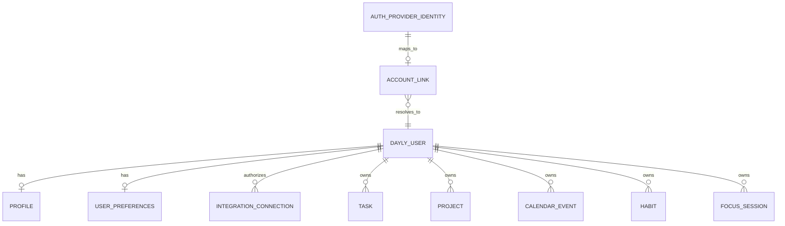

# Dayly Authentication and Identity Integration Model

**Phase:** 0D — Integration Architecture
**Status:** In progress
**Related documents:** [`INTEGRATION_ARCHITECTURE.md`](INTEGRATION_ARCHITECTURE.md), [`DATA_OWNERSHIP.md`](DATA_OWNERSHIP.md), [`DATABASE_SCHEMA.md`](DATABASE_SCHEMA.md)

> Authentication implementation is out of scope. This document defines the conceptual identity boundary needed for future account and integration work. It does not choose an auth provider, implement sessions, create routes, store credentials, or create policies.

## 1. Distinct identity concepts

Dayly must distinguish four related but different concepts:

```text
Authentication provider identity
          ↓ maps to
Dayly Account Link
          ↓ resolves to
Dayly User principal
          ↓ owns
Integration Connections and Dayly records
```

- **Provider identity:** Identity known by an authentication provider, such as a provider subject identifier.
- **Account Link:** Dayly's reference that a provider identity is linked to a Dayly User.
- **User:** Dayly's stable ownership principal for Tasks, Projects, Calendar Events, Habits, Focus Sessions, and preferences.
- **Session:** Temporary authenticated access context; it is not the owner of domain data.
- **Integration Connection:** A separate, feature-specific authorization relationship to an external data provider.

A user signing into Dayly with a Google identity does not automatically grant Google Calendar access. Authentication and calendar integration require separate consent and connection state. Similarly, an Apple sign-in identity is not the same thing as Apple Calendar/iCloud calendar authorization.

## 2. Conceptual identity model



The diagram is conceptual and does not define physical tables or an authentication vendor.

## 3. User/account ownership

### Dayly User

The User principal is the stable owner referenced by Dayly domains. It should remain stable if the user changes email, login provider, display name, or session.

### Account Link

An Account Link can hold:

- authentication provider key;
- provider subject/reference;
- Dayly User relationship;
- link status;
- created/revoked moments;
- verification/assurance metadata where required.

Provider secrets, passwords, access tokens, and refresh tokens do not belong in an Account Link.

### Profile

Profile contains supported personal presentation fields such as display name. It is not the source of authentication state and does not need to mirror provider profile data without a deliberate consent/product decision.

### Session

A Session represents temporary authenticated access. It should be:

- short-lived or bounded by the future session policy;
- revocable;
- protected against fixation/replay;
- scoped to a Dayly User;
- absent from ordinary domain records except through the current actor context.

Exact cookie/token/session technology is unresolved.

## 4. Mapping rules

### 4.1 Do not match by email alone

Email may change, be unverified, be shared, or differ across systems. A future mapping must use a provider and stable provider subject/reference, then explicitly link it to a Dayly User.

### 4.2 Keep authentication and data integrations separate

```text
Auth Account Link: “This provider identity can authenticate this User.”
Integration Connection: “This User has consented to this provider's data capability.”
```

An auth link may exist without an integration connection. An integration connection may use an external account identity without becoming a login account.

### 4.3 Provider changes

Linking another login provider to an existing User must require an authenticated, intentional account action. A provider connection must never silently create a second User merely because the external email differs.

### 4.4 Account deletion and unlinking

Unlinking an authentication provider must not delete Dayly records if another recovery/auth path remains, subject to the future account policy. Deleting the User invokes the data lifecycle/export policy and separately handles integration credentials/caches.

## 5. Authorization and RLS relationship

At request time, the future application should resolve:

```text
Authenticated session
      ↓
Dayly User principal
      ↓
User-owned records / Integration Connections
```

- RLS or an equivalent database enforcement scopes client-readable records to the User.
- Application services validate the actor before integration operations.
- Provider identity is not a substitute for Dayly User ownership.
- Future team sharing would require explicit membership/role records and cannot be inferred from account links.

## 6. Integration identity mapping

For a future data provider:

```text
Dayly User
    │ authorizes
    ▼
Integration Connection
    │ stores provider-scoped external account reference
    ▼
External provider account
```

The mapping must include provider namespace and external subject/account identifier. It should record connection/consent status, but not expose credentials to the browser or client domain APIs.

The external provider's subject is not copied into Task, Calendar Event, Habit, or Nutrition summary content as an owner ID.

## 7. OAuth/security principles

The future authentication/integration implementation must follow:

- authorization code/server-side exchange or another provider-approved secure flow;
- PKCE or equivalent protections where applicable;
- redirect URI allowlisting and state/nonce verification;
- short-lived access credentials where possible;
- encrypted refresh-token storage in a secrets boundary;
- no tokens in URLs, browser local storage, ordinary database reads, analytics, or logs;
- explicit scopes and user-facing consent;
- token refresh/revocation handling;
- session rotation/revocation after sensitive account events;
- TLS in transit and managed encryption at rest;
- least-privilege service roles and auditability.

These are architectural requirements, not claims that they are implemented.

## 8. Account lifecycle concept

```text
Unregistered
     ↓ account created
Active User
     ├── account link added/removed
     ├── session created/revoked
     ├── integration connected/revoked independently
     └── deletion/export requested
Deletion Pending
     ↓ approved purge policy
Deleted/Anonymized User
```

The exact states, recovery window, export timing, and anonymization rules require a later account/privacy decision.

## 9. Provider identity verification questions

Before implementation, verify for the selected authentication provider:

- stable subject identifier semantics;
- email verification and change behavior;
- account linking/unlinking capabilities;
- session/token expiration and revocation;
- MFA or assurance signals if Dayly needs them;
- provider terms and privacy obligations;
- redirect/callback and environment configuration;
- account deletion/webhook behavior.

Do not assume that a provider's authentication identity grants access to its calendar, health, or other APIs.

## 10. Open identity decisions

- Final authentication provider and session model.
- Whether multiple authentication Account Links can map to one User.
- Recovery behavior if the last login link is removed.
- Profile fields and provider profile synchronization.
- Account deletion/export grace period and audit retention.
- Whether a personal Workspace concept is needed or User remains the sole owner.
- Provider identity linking UX and re-authentication requirements.
- How integration authorization maps when an external account differs from the auth account.
- Exact RLS/session claims and server-side service boundaries.

## 11. Phase boundary

No authentication provider, OAuth callback, session implementation, token store, database migration, API route, UI, or application code was created.
