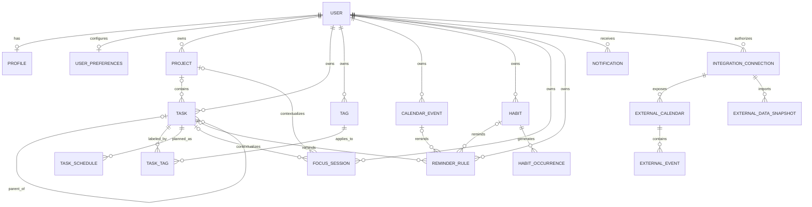
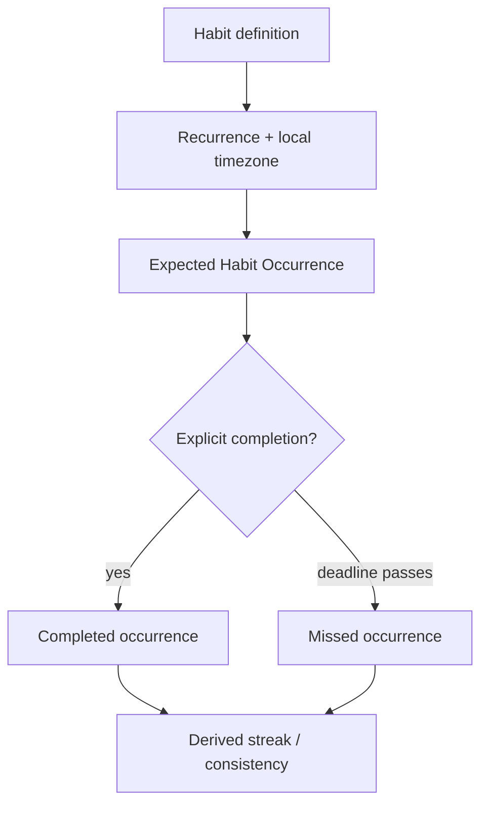
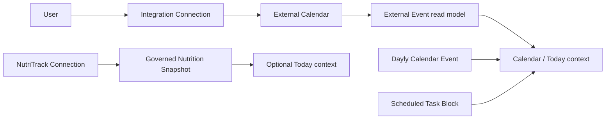

# Dayly Domain Model

**Phase:** 0C — Domain Model & Database Architecture
**Status:** In progress
**Source of truth:** [`PRODUCT_SPEC.md`](../../PRODUCT_SPEC.md), the approved UX documents in [`../ux/`](../ux/), and [`PROJECT_STATE.md`](../../PROJECT_STATE.md)

> This document defines the conceptual domain model and logical ownership boundaries. It is not a physical database schema, SQL migration, API contract, authentication implementation, integration implementation, or application code.

## 1. Modeling goals

Dayly's data model must support the user's daily loop without turning every screen concept into a stored record:

```text
Understand the day
       ↓
Choose what matters
       ↓
Allocate time
       ↓
Execute
       ↓
Review
```

The model should:

- keep Task, Project, Calendar Event, Scheduled Task Block, Habit, and Focus Session distinct;
- make user ownership explicit on every Dayly-owned record;
- use relationships for genuine one-to-many and many-to-many behavior rather than duplicating source data;
- distinguish user-entered facts from derived views and analytics;
- preserve enough timestamps, time-zone context, and provenance for trustworthy planning;
- support MVP workflows without prematurely modeling collaboration, AI, medical data, or provider-specific behavior;
- remain extensible for future external calendar and NutriTrack connections.

## 2. Scope and contradiction register

### 2.1 Approved product decisions carried forward

- Dayly is a personal product in the initial scope.
- Today is a composed daily view, not a separate user-owned record.
- A Task is actionable work; a Project is an outcome-oriented container.
- A Task is not a Calendar Event, Habit, or Focus Session.
- A Task can have a deadline and zero or more planned Scheduled Task Blocks.
- Focus Sessions record actual effort and do not complete Tasks automatically.
- Habits are recurring behaviors with occurrences and consistency; they are not recurring Tasks.
- Dayly owns its own calendar layer. External providers own external events.
- NutriTrack owns nutrition and health data; Dayly may consume a governed read-oriented subset.
- Analytics, Streak, Consistency, Project Progress, Daily Progress, and Overdue are derived concepts.

### 2.2 Ambiguities carried forward rather than silently resolved

| Topic | Current model treatment | Decision still required |
|---|---|---|
| Task `Cancelled` state | Not an MVP canonical status; no cancellation transition is exposed yet. | Whether cancellation deserves separate history and behavior instead of Archive. |
| Inbox | A Tasks triage view/condition, not an entity. | Whether an explicit triage flag or a derived rule is needed. |
| Planned | A planning view/condition, not a lifecycle status. | Exact rule for when a task enters the Planned view. |
| Project progress | Derived from task/project facts, but no formula is locked. | Formula, denominator, estimates, and partial-completion treatment. |
| Nested subtasks | MVP recommendation is one parent level. | Whether deeper hierarchy is needed later. |
| Habit exceptions | Occurrences support the basic due/completed/missed path. | Pause, skip, backfill, recurrence-change, and streak effects. |
| External synchronization | Provider-neutral read models are reserved for post-MVP. | Direction, conflicts, permissions, and retention. |
| NutriTrack summaries | A governed cached/read model is reserved for post-MVP. | Contract, metrics, freshness, consent, and retention. |
| Account/workspace | Personal User ownership is modeled; authentication is outside this phase. | Account, recovery, workspace, and future collaboration model. |

These are deliberately visible open decisions. A future physical schema must not encode an unresolved product choice as if it were settled.

## 3. Bounded contexts

| Context | Owns | Reads from | Must not own |
|---|---|---|---|
| **Identity and preferences** | User ownership principal, Profile, planning preferences, availability rules, notification preferences | Authentication boundary when later defined | Provider authentication implementation or domain records |
| **Tasks** | Task lifecycle, task content, task/project membership, task tags | Projects, schedules, focus summaries, reminders | Calendar provider events, habit occurrences, nutrition data |
| **Projects** | Project outcome and lifecycle | Tasks and derived progress | Task completion rules, calendar ownership, focus timing |
| **Scheduling** | Scheduled Task Blocks and planning relationships | Tasks, Dayly Events, availability, future external events | Task completion or provider event ownership |
| **Dayly Calendar** | Dayly-owned Calendar Events and their recurrence context | Tasks/schedules, future external event read models | External provider source of truth |
| **Habits** | Habit definitions and occurrence ledger | Preferences/time zone, notifications, analytics | Task completion, nutrition logic, medical conclusions |
| **Focus** | Focus Sessions and actual effort records | Tasks/Projects, clock/time-zone context | Task completion or schedule mutation |
| **Notifications** | Reminder intent and in-product notification state | Tasks, Events, Habits, integration sync states | Source records or provider delivery infrastructure in MVP |
| **Analytics and derived views** | No primary business facts; optional read/cache projections only | All relevant contexts | Editable duplicates of source records |
| **Integrations** | Connection identity, consent/scope, provider read models and sync metadata | External providers | Dayly-owned tasks/events or NutriTrack internal logic |
| **Search** | No source domain; an optional derived search projection | Supported source records | A second editable copy of records |

## 4. Core relationship diagram



The diagram is a domain relationship view. It does not prescribe table names, foreign-key syntax, or an ORM.

## 5. Entity catalog

### 5.1 User

**Purpose:** Stable Dayly ownership principal for personal records.

**Ownership:** The identity boundary owns the relationship between a person and their Dayly user principal. Dayly uses the principal for record isolation.

**Lifecycle:** Provisioned when a personal Dayly workspace/principal is created; active until account deletion or deactivation is defined.

**Relationships:** Owns Profile, User Preferences, Projects, Tasks, Tags, Calendar Events, Habits, Focus Sessions, Reminders, Notifications, and Integration Connections.

**Source of truth:** Dayly's identity/application boundary, not an authentication provider's user table directly.

**User-editable:** The user may manage supported identity/profile settings, but the ownership identifier is not user-editable.

**Derived:** No. Other records may derive access scope from it.

**Retention:** The ownership principal and deletion state must remain long enough to enforce isolation and perform the eventual export/deletion flow. Exact retention and recovery are open.

### 5.2 Account

**Purpose:** Conceptual boundary for login/account lifecycle, recovery, and future authentication providers.

**Ownership:** Authentication/platform boundary; not a Dayly productivity domain.

**Lifecycle:** Not designed in Phase 0C. It may be one-to-one or one-to-many with User depending on the future account model.

**Relationships:** Resolves to a User principal; does not own Tasks or Calendar Events directly.

**Source of truth:** Future authentication/account architecture.

**User-editable:** Account/security controls will be user-managed when designed; no implementation is authorized now.

**Derived:** No, but the relationship to User may be resolved by an authentication service.

**Retention:** Account deletion and recovery requirements remain open. Account credentials/secrets must not be duplicated in Dayly domain records.

### 5.3 Profile

**Purpose:** Optional personal presentation information used in onboarding and settings, such as display name and supported avatar reference.

**Ownership:** User-owned by Dayly.

**Lifecycle:** Created with or after User; editable while active; removed or anonymized according to account deletion policy.

**Relationships:** One Profile per User conceptually; displayed by shell/onboarding/settings.

**Source of truth:** Dayly Profile.

**User-editable:** Yes, for fields Dayly explicitly supports.

**Derived:** No. Display labels elsewhere are read projections.

**Retention:** Keep only necessary personal fields; no social profile or public feed is implied.

### 5.4 User Preferences

**Purpose:** Personal behavior settings: locale, default time zone, planning defaults, notification preferences, appearance preferences, and other product choices.

**Ownership:** User-owned by Dayly.

**Lifecycle:** One active preference set per User conceptually; fields may be added additively.

**Relationships:** Read by Tasks, Scheduling, Calendar, Habits, Notifications, Dashboard, and Analytics.

**Source of truth:** Dayly preferences, not a duplicated provider setting.

**User-editable:** Yes, through Settings.

**Derived:** No. Effective day views may derive behavior from preferences.

**Retention:** Retain while the User is active; preserve enough metadata for export/deletion. Historical facts must not be rewritten merely because a default preference changes.

### 5.5 Availability Rule and Exception

**Purpose:** Represent recurring working/available windows and future exceptions used as planning constraints.

**Ownership:** User-owned Dayly planning preferences.

**Lifecycle:** Rules can be created, edited, enabled/disabled, and superseded; exceptions apply to a defined local date/time.

**Relationships:** Read by Today, Calendar, Scheduling, and Analytics; interpreted using the relevant time zone.

**Source of truth:** Dayly planning settings. External calendars may provide context later but do not define the user's entire availability automatically.

**User-editable:** Yes, through Planning settings.

**Derived:** The effective availability for a date is derived from rules and exceptions; the rules themselves are source data.

**Retention:** Active rules and relevant historical exceptions should be retained according to export needs. Exact history is not yet required.

### 5.6 Project

**Purpose:** Outcome-oriented container for related Tasks.

**Ownership:** User-owned by Dayly.

**Lifecycle:** MVP candidate states are active and archived. Paused/closed semantics require a later product decision; Archive is not silently renamed Cancelled.

**Relationships:** A Project has zero or more Tasks. A Task has zero or one Project in the MVP model. Project progress reads Task facts and project metadata.

**Source of truth:** Dayly Project record.

**User-editable:** Name, outcome, description, target context, priority, lifecycle, and task membership/order where supported.

**Derived:** Project progress, attention state, and task counts are derived.

**Retention:** Archive removes a project from active planning but does not delete Tasks. Hard deletion should be explicit and account/data-policy controlled.

### 5.7 Task

**Purpose:** Discrete, actionable unit of work that the user explicitly completes or leaves open.

**Ownership:** User-owned by Dayly; optional Project association is also Dayly-owned.

**Lifecycle:** Canonical candidate lifecycle is Open, In Progress, Completed, and Archived. Cancellation is not an MVP state; Overdue, Scheduled, Planned, and Inbox are conditions/views.

**Relationships:** Optional Project; optional parent Task; zero or more child Tasks within the MVP depth rule; zero or more Tags through an association; zero or more Task Schedule Blocks; optional Reminders; zero or more Focus Sessions.

**Source of truth:** Dayly Task record. Task title, description, priority, deadline, lifecycle, and project membership are not copied from derived views.

**User-editable:** Title, description, priority, deadline, estimate, project, tags, schedule, subtasks, reminders, and lifecycle actions according to product rules.

**Derived:** Overdue, Planned, Scheduled, actual duration aggregate, and project/dashboard/analytics summaries are derived or related facts.

**Retention:** Active tasks remain queryable; Completed tasks remain available for history/analytics; Archived tasks leave active views. Deletion, export, and retention are governed by the lifecycle document.

### 5.8 Task-Tag Association

**Purpose:** Many-to-many relationship between a User's Tasks and Tags.

**Ownership:** Owned through the User and both related records; it must never connect records across users.

**Lifecycle:** Created/removed when a tag is assigned or unassigned; removing an association does not delete the Tag or Task.

**Relationships:** Task ↔ Tag.

**Source of truth:** The association itself is the source of task labeling.

**User-editable:** Yes, through task/tag actions.

**Derived:** No, although filtered lists derive from it.

**Retention:** Association can be removed independently; task/tag retention follows the related records.

### 5.9 Tag

**Purpose:** User-owned lightweight label for retrieval and classification.

**Ownership:** User-owned; tags are not global reference data in the personal MVP.

**Lifecycle:** Created, renamed, merged only if a future rule supports it, unused, and optionally removed. Deleting a Tag removes associations but not Tasks.

**Relationships:** Many-to-many with Tasks in MVP; future Project/Habit use requires explicit scope and association design.

**Source of truth:** Dayly Tag record.

**User-editable:** Name and supported appearance metadata, if any.

**Derived:** Usage counts are derived.

**Retention:** Unused tags may remain or be cleaned up by an explicit user action; automatic deletion is not required for MVP.

### 5.10 Task Schedule Block

**Purpose:** A planned interval in which the user intends to work on a Task.

**Ownership:** User-owned by Dayly Scheduling; it is not a Calendar Event and not owned by a provider.

**Lifecycle:** Planned, moved/rescheduled, and removed or superseded. Completion of a block is not equivalent to task completion; actual effort comes from Focus Sessions.

**Relationships:** Belongs to one Task and is shown by Today/Calendar. It is evaluated against Dayly Events, external event read models, and Availability Rules.

**Source of truth:** Dayly schedule block. The Task remains the source of task meaning.

**User-editable:** Start/end, date, and removal/rescheduling are user-editable.

**Derived:** Conflicts, remaining planned time, and Scheduled view membership are derived.

**Retention:** Keep enough history or current state for plan review according to the later analytics decision. MVP may retain current blocks and remove superseded blocks without a full plan-event ledger.

### 5.11 Calendar Event

**Purpose:** Dayly-owned time-bound commitment or occurrence separate from actionable Tasks.

**Ownership:** User-owned by Dayly Calendar.

**Lifecycle:** Created, edited, recurring/exception-managed when supported, cancelled or deleted according to the event policy. External events are not Calendar Event records.

**Relationships:** May have reminders. A deliberate optional link to a Task may be added later, but an event does not become a Task through linking.

**Source of truth:** Dayly Calendar Event for Dayly-owned events.

**User-editable:** Title, start/end, all-day setting, recurrence, time zone, location, notes, and reminders where supported.

**Derived:** Calendar views and conflict markers are derived.

**Retention:** Historical events may be retained for planning context; deletion and recurrence exception retention require a later policy.

### 5.12 Habit

**Purpose:** Definition of a recurring behavior and its recurrence/time-zone context.

**Ownership:** User-owned by Dayly Habits.

**Lifecycle:** Active, paused when supported, and archived. The effect of pause on streak and occurrence generation remains unresolved.

**Relationships:** Generates Habit Occurrences; may have Reminder Rules; appears in Today and Analytics.

**Source of truth:** Dayly Habit definition and recurrence rule.

**User-editable:** Name, recurrence, preferred local time/context, reminder choice, and supported lifecycle actions.

**Derived:** Current streak, consistency, next due occurrence, and missed status are derived from definition and occurrences.

**Retention:** Keep historical occurrences and the habit definition long enough to support consistency review and export. Archive should not erase history.

### 5.13 Habit Occurrence

**Purpose:** Expected instance of a Habit on a particular local date/time window, with an explicit completion/missed outcome when known.

**Ownership:** User-owned by Dayly and generated from the user's Habit rule.

**Lifecycle:** Expected/due, completed, or missed for the MVP path. Skipped, suppressed, paused, and backfilled states require later rules and should not be implied.

**Relationships:** Belongs to one Habit; may have one Reminder Rule/Notification context; does not become a Task.

**Source of truth:** The occurrence ledger for whether a specific expected instance was completed or missed; the Habit rule remains the source for future generation.

**User-editable:** Completion action is user-editable; expected time is not casually rewritten after creation. Corrections/backfill require explicit policy.

**Derived:** The next due occurrence, streak, and consistency are derived; materialized occurrences are source facts once created.

**Retention:** Preserve completed/missed occurrence history for analytics and export. Exact purge window is open.

### 5.14 Focus Session

**Purpose:** Record intentional work effort and actual duration, optionally associated with a Task or Project.

**Ownership:** User-owned by Dayly Focus.

**Lifecycle:** Active, Paused, Completed, or Abandoned/terminated according to the eventual session policy. A session may be orphaned, meaning it has no Task or Project context.

**Relationships:** Has zero or one direct Task context or zero or one direct Project context in the recommended MVP model; a Task's Project context can be derived. It contributes to Task actual-duration reporting.

**Source of truth:** Dayly Focus Session start/end/pause facts for recorded effort.

**User-editable:** Start/finish actions, optional context before/during the session, interruption note, and supported correction fields.

**Derived:** Actual duration is derived from session timing and paused duration; Task actual duration is an aggregate, not a duplicated editable counter.

**Retention:** Completed sessions should remain for analytics and history. Abandoned sessions may be retained as incomplete facts or cleaned according to a later policy; do not count them as completed focus time without a rule.

### 5.15 Reminder Rule

**Purpose:** User-controlled intent to prompt about a Task, Calendar Event, Habit occurrence, Focus session, or supported system condition.

**Ownership:** User-owned by Dayly; source record remains owned by its domain.

**Lifecycle:** Active, scheduled, snoozed/modified, disabled, and expired according to trigger semantics.

**Relationships:** Has one supported source relationship and may create zero or more in-product Notifications. Provider delivery is not required for MVP.

**Source of truth:** Dayly Reminder Rule for user intent; Task/Event/Habit remains source of the underlying item.

**User-editable:** Yes, within supported reminder options.

**Derived:** A due reminder occurrence and notification timing are derived from rule + source state.

**Retention:** Retain active rules; expired or handled instances can be pruned after the retention policy is defined.

### 5.16 Notification

**Purpose:** User-visible in-product reminder or system/integration message with read, dismissed, or handled state.

**Ownership:** User-owned by Dayly Notifications.

**Lifecycle:** Scheduled/generated, available, read/handled, snoozed, dismissed, or expired. Exact status vocabulary may remain small for MVP.

**Relationships:** May reference a Reminder Rule and a source record; it never replaces the source record.

**Source of truth:** Dayly notification state for what the user has seen/handled; delivery attempts are a future channel concern.

**User-editable:** Read, dismiss, snooze, and preference actions; trigger source content is not edited here.

**Derived:** A notification instance is generated from a reminder/source condition, but its read state is user-owned fact.

**Retention:** Keep actionable/unread items; expire handled notifications after a bounded period. Do not retain an unbounded inbox by default.

### 5.17 Integration Connection

**Purpose:** Provider-neutral identity, consent, selected scope, and sync status for an optional external connection.

**Ownership:** User-authorized Dayly integration boundary; the provider owns the external account and source data.

**Lifecycle:** Disconnected, authorization pending, connected, stale/error, revoked, or disconnected. Exact provider state mapping is future work.

**Relationships:** Belongs to a User; may expose External Calendars, External Events, or NutriTrack read snapshots.

**Source of truth:** Dayly connection metadata plus provider authorization state; not a copy of provider business records.

**User-editable:** Connection, selected scope, consent, refresh request, and disconnect are user-controlled; provider IDs are not freely edited.

**Derived:** Connection health and freshness are derived from sync metadata.

**Retention:** Connection metadata and consent audit need a future privacy/retention policy; disconnect must not silently delete Dayly-owned records.

### 5.18 External Calendar, External Event, and External Data Snapshot

**Purpose:** Provider-neutral read models for future external events and governed NutriTrack summaries.

**Ownership:** External source owns the source data; Dayly owns only the cached representation and provenance metadata.

**Lifecycle:** Imported/refreshed, stale, changed, deleted-at-source, conflicted, or disconnected according to the future provider contract.

**Relationships:** External Calendar and External Event belong to an Integration Connection. External Data Snapshot belongs to a provider connection and carries a source period/metric category.

**Source of truth:** Provider for source facts; Dayly cache for the last synchronized representation and its freshness state.

**User-editable:** The user manages scope/connection, not provider event/nutrition values through the Dayly MVP.

**Derived:** Freshness, conflict, and sync health are derived from metadata and synchronization results.

**Retention:** Imported values and event mirrors require explicit disconnect/deletion/retention decisions. Do not retain a full uncontrolled copy of NutriTrack.

## 6. Task composition, project ordering, and scheduling decisions

### 6.1 Subtask relationship

Subtasks are Tasks with an optional parent Task relationship, not a separate Subtask entity.

- **Hierarchy depth:** MVP supports one parent level: a parent Task may have child Tasks, but a child may not itself have children. A self-referential adjacency model can be extended later if deeper nesting is approved.
- **Completion:** Parent and child completion are explicit and independent. Completing every child does not automatically complete the parent; completing a parent does not automatically complete its children. A future UX may suggest the next action, but it must not silently change state.
- **Deletion/archive:** Archiving or removing a parent must not silently destroy children. The future action must choose among retaining children, reparenting them, or archiving them. MVP should prefer archive and preserve the relationship until an explicit policy exists.
- **Progress:** Parent/child progress is derived. A project formula must avoid counting both an organizing parent and its children as separate work without an explicit weighting rule.
- **Scheduling:** A child Task can have its own zero-to-many Schedule Blocks. A parent may also be schedulable only if it represents real work; an organizational parent must not receive an automatic block.
- **Focus:** A Focus Session may reference a child Task. Parent actual effort can aggregate child sessions only if the later progress/analytics definition chooses that behavior; no duplicate duration is stored.

### 6.2 Project task ordering and progress

- A Project contains zero or more Tasks, with one optional Project per Task in the MVP.
- Task ordering within a Project is user-facing organization, not completion truth. A future ordering value may be stored on the Task or a membership record; a separate membership entity is not justified while multi-project membership is out of scope.
- Progress is derived from Project lifecycle and related Task facts. The model must retain task status, deadlines, estimates, completion moments, and project membership so a later formula can use count-based, weighted, or time-based strategies.
- No progress percentage is persisted as an authoritative user-editable field.
- An archived Project retains its Task relationships and historical analytics.

### 6.3 Tag scope

Tags are User-owned labels with normalized uniqueness per User. MVP uses a Task-Tag association only. Project and Habit tagging can be added through explicit relationships later rather than making the tag system polymorphic before it is needed.

### 6.4 Scheduling choice and trade-off

The logical model supports **zero or more Task Schedule Blocks per Task**. This is the recommended Phase 0C choice:

- Zero blocks keeps Inbox/open work valid.
- One block supports the simple MVP planning interaction.
- Multiple blocks support split work, rescheduling, and future planning reliability without changing the core relationship.
- Each block remains a plan; it does not record actual effort or complete the Task.

The trade-off is a slightly richer persistence concept than a single `scheduled_at` value. That complexity is justified because the product specification already distinguishes a schedule from a deadline and allows work to be split. The MVP UI may expose one block first while preserving the one-to-many model.

### 6.5 Time-zone interpretation

- Store instants with unambiguous instant semantics for actual events such as Task completion, Focus start/end, and record creation.
- Preserve an IANA time zone and local precision for a deadline, Schedule Block, recurring Habit, and recurring Calendar Event when local wall-clock intent matters.
- A date-only deadline remains date-only; it must not be converted to UTC midnight and displayed as a misleading time.
- Habit occurrence generation uses the Habit's zone or explicitly inherited User zone.
- Calendar recurrence uses the Event's zone or an explicit provider zone.
- Changing User default time zone affects future preferences, not already-recorded historical instants.

### 6.6 Actual duration ownership

The Task product model exposes actual duration for review, but Focus Sessions are the factual source. The recommended architecture is:

```text
Completed Focus Sessions
          ↓ aggregate by Task
Task actual-duration read value
```

A missing session aggregate means unknown, not zero. A future manual correction should be an explicit adjustment with provenance rather than an editable number that competes with Focus history.

## 7. Derived concepts and non-entities

| Concept | Source facts | Computation/behavior | Persisted by default? |
|---|---|---|---|
| **Inbox** | Task content and triage/planning metadata | Tasks needing organization are selected into a Tasks view. | No separate entity; explicit triage flag is unresolved. |
| **Today** | User time zone, Tasks, Task Schedule Blocks, Calendar Events, Habits, Focus, Notifications, availability | Composes current-day context and actions. | No. A short-lived read cache may be added for performance only. |
| **Overdue** | Incomplete Task + deadline + current relevant time | Derived when the deadline has passed. | No status column by default. |
| **Planned** | Task planning metadata and/or schedule policy | Tasks intentionally prepared for work. | No separate record; entry rule is unresolved. |
| **Scheduled** | Task Schedule Blocks | Tasks with at least one active block. | No task status; query/view. |
| **Streak** | Habit recurrence + completed/missed occurrences | Consecutive expected occurrences under the MVP rule. | No source entity; optional cache only if measured. |
| **Consistency** | Habit expected/completed occurrence history | Ratio/count over a stated period. | No source entity; calculated on demand or cached later. |
| **Project Progress** | Project state + related Task facts | Strategy-dependent measure of work remaining/completed. | No final stored percentage; formula deferred. |
| **Daily/Weekly/Monthly Progress** | Tasks, schedules, focus, habits, events, period/time zone | Decision-support summaries for a defined period. | No default entity; analytics cache only if needed. |
| **Analytics** | All approved source facts | Read-only measures and drill-downs. | No source domain entity. |
| **Daily Briefing** | Today context and notification preferences | Optional future presentation/notification summary. | No MVP entity; should not duplicate Today. |
| **Search Index** | Titles, descriptions, project/tag/source metadata | Derived retrieval projection if native queries require it. | No dedicated MVP entity; use source records/native database search first. |

## 8. Cross-domain rules

- A Task Schedule Block points to a Task and never changes the Task into a Calendar Event.
- A Calendar Event can exist without a Task and does not automatically create one.
- A Focus Session can reference a Task or Project, but finishing it never changes Task status.
- A Habit Occurrence cannot be satisfied automatically by Task completion, an Event, or a Focus Session.
- A Project contains Tasks; Project Progress is derived from them and is not a second completion record.
- External Events and NutriTrack snapshots retain provenance and cannot silently become Dayly-owned facts.
- Analytics, Today, Search, and Daily Briefing are read models/views over source domains.

## 9. Task and scheduling model


The recommended logical relationship is one Task to zero or many Schedule Blocks. MVP UI may expose one block first, but the model should not require a later migration merely to support split work or rescheduling history.

## 10. Habit model



Future occurrence generation should be lazy or rolling rather than inserting an unbounded future series. Once an occurrence is materialized and acted upon, it becomes a historical ledger fact.

## 11. Calendar and integration model



Dayly Calendar Events and Scheduled Task Blocks remain Dayly-owned. External Events and Nutrition Snapshots are source-labeled read models with provider provenance.

## 12. NutriTrack boundary model


Candidate future categories for consumption, subject to contract and consent, are:

- daily nutrition summary;
- energy/calorie summary if NutriTrack exposes it for this purpose;
- broad macro or meal-completeness summary;
- other explicitly approved, non-medical context needed by a Dayly decision.

These are categories, not an API contract or a commitment to expose a specific metric. Dayly must not recreate NutriTrack calculations or provide medical interpretation.

## 13. Modeling decisions for later schema work

- Prefer one User ownership path for all Dayly-owned records.
- Prefer nullable relations for optional Task Project, Task parent, and Focus context rather than placeholder records.
- Prefer a child Schedule Block record for repeatable planned intervals rather than putting one schedule timestamp on Task.
- Prefer a Habit Occurrence ledger for historical completion rather than deriving all history from the current recurrence rule.
- Prefer actual duration as an aggregate of completed Focus Sessions rather than a separately edited Task counter.
- Prefer source/provenance fields on external read models rather than copying provider objects into Dayly's core domains.
- Prefer on-demand derived views until measurement demonstrates a need for cached projections.
- Prefer additive, reversible evolution when an unresolved product rule becomes concrete.

## 14. Open data-model questions

These decisions are intentionally not encoded as final physical schema behavior:

- Should Task status transitions be stored as an append-only history for reopen and analytics?
- Is `Cancelled` a canonical Task state distinct from Archive, and what is its retention/analytics behavior?
- Should Inbox and Planned use explicit Task metadata or remain fully derived views?
- Should nested subtasks ever exceed one level, and how should parent/child progress avoid double counting?
- Should superseded Schedule Blocks be retained for planning-reliability analytics?
- What formula and denominator define Project Progress?
- How are Habit Occurrences generated, materialized, and deduplicated across time-zone/DST changes?
- How do recurrence changes, pause, skip, missed, and backfill affect historical occurrence facts?
- Which Reminder Rules and Notification instances persist, and for how long?
- What is the offline synchronization/reconciliation model for user actions?
- What is the Account/Profile/Workspace ownership model when authentication is designed?
- What provider-neutral conflict record is required for external calendars?
- What NutriTrack read model, metric scope, freshness, and retention are approved?
- Is native PostgreSQL text search sufficient as the search scope expands, or is a rebuildable projection needed?

## 15. Phase boundary

This domain model does not authorize:

- physical tables or SQL;
- migrations, indexes, or Row-Level Security policies being executed;
- application code or an ORM;
- authentication;
- provider synchronization;
- NutriTrack API contracts;
- PHASE 0D Integrations Architecture.
