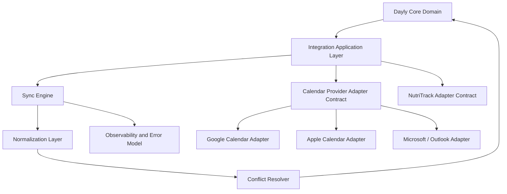
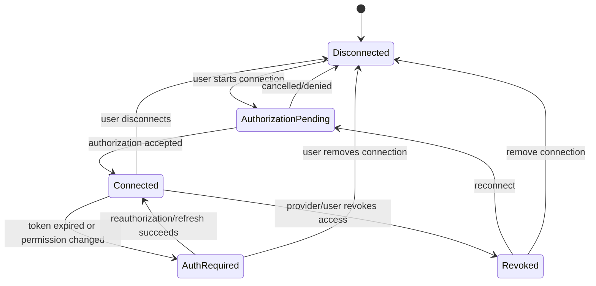
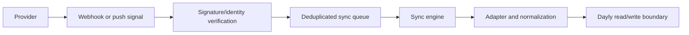

# Dayly Integration Architecture

**Phase:** 0D — Integration Architecture
**Status:** In progress
**Source of truth:** Approved product, UX, and data architecture documents in this repository

> This document defines provider-neutral integration boundaries and operational principles. It does not implement OAuth, provider SDKs, API routes, synchronization, UI, credentials, database migrations, or application code.

## 1. Scope and goals

Dayly integrations are optional extensions to a useful personal productivity core. They must bring external context into Dayly without transferring ownership of external systems or coupling the core domain to provider behavior.

The architecture must:

- keep Dayly Tasks, Projects, Calendar Events, Schedule Blocks, Habits, Focus Sessions, and Analytics provider-neutral;
- make source ownership and provenance visible;
- minimize data, permissions, credentials, and retention;
- make repeated sync safe and observable;
- preserve Dayly usability when an integration is stale, disconnected, rate-limited, or unavailable;
- make conflicts visible rather than silently overwriting data;
- support future Google Calendar, Apple Calendar, Outlook, and NutriTrack adapters without changing the core domain model;
- allow an integration to be disconnected or revoked without silently deleting Dayly-owned records.

The initial implementation is not authorized by this phase. The MVP remains useful without external integrations, as defined in `PRODUCT_SPEC.md`.

## 2. Integration principles

### 2.1 Explicit ownership

Every synchronized fact has one source owner. Dayly-owned Calendar Events and Schedule Blocks remain Dayly-owned. Google, Apple, or Outlook events remain provider-owned unless a future write contract explicitly creates a provider representation of a Dayly object. NutriTrack remains the owner of nutrition and health records.

**Why it matters:** Without explicit ownership, a sync process can overwrite the wrong system, create duplicate sources of truth, or turn an imported event into an editable Dayly record by accident.

### 2.2 Source provenance

An imported or normalized record carries provider, external account/calendar identity, source identifier, source update time when available, import time, and freshness/sync state.

**Why it matters:** Users and operators must be able to tell where a value came from, whether it is current, and which system should be contacted to change it.

### 2.3 Least privilege

Ask for the smallest provider permission that supports the approved feature. Start with read-oriented access where possible. Separate calendar selection and data category consent from broad account access.

**Why it matters:** Narrow permissions reduce privacy exposure, breach impact, user surprise, and the amount of provider-specific behavior Dayly must support.

### 2.4 User consent

The user must understand what provider is connected, what Dayly will read or write, which calendars/categories are selected, how freshness works, and what disconnecting does. Consent and scope changes are explicit events in the connection lifecycle.

**Why it matters:** Authorization is not the same as informed consent for a particular Dayly feature.

### 2.5 Provider isolation

Provider-specific authentication, pagination, recurrence mapping, rate-limit handling, webhook verification, and error parsing live behind provider adapters. Core domain services consume normalized capabilities, not provider branches.

**Why it matters:** Provider changes should not alter Task, Calendar, or NutriTrack domain rules and should not produce conditionals throughout the application.

### 2.6 Idempotency

Every import/export operation uses a stable provider-scoped identity and an operation/idempotency key. Replaying a page, webhook, job, or retry must not create duplicate external mirrors or duplicate Dayly mutations.

**Why it matters:** Network retries and at-least-once delivery are normal; duplicate events are not acceptable.

### 2.7 Retry safety

Retries occur only for operations whose side effects are idempotent or protected by an idempotency key. Backoff and retry classification are explicit, and user-action errors are not retried forever.

**Why it matters:** A retry that is safe for a read may duplicate an export or repeatedly trigger a revoked authorization flow.

### 2.8 Conflict visibility

If Dayly and a provider changed the same logical event, or a provider deleted/changed an item Dayly expects, the system records a conflict or actionable state. It does not silently prefer the last request.

**Why it matters:** Silent conflict resolution can destroy plans and erode trust in both systems.

### 2.9 Sync observability

Track connection, operation, provider, start/end, result, record counts, cursor/freshness, error category, and correlation identifiers without logging secrets or unnecessary payloads.

**Why it matters:** Users need useful health messages and operators need to diagnose stale data without inspecting private content.

### 2.10 Graceful degradation

Dayly-owned Tasks, Projects, Calendar Events, and planning remain usable when external data is stale or unavailable. External content is labeled stale/unavailable rather than replaced by false current values.

**Why it matters:** Integrations add context; they must not make the core productivity product unusable.

### 2.11 Revocation awareness

The architecture distinguishes user disconnect, provider token expiration, provider permission revocation, and provider account deletion. Each stops or limits access and provides a recovery path without pretending the connection is healthy.

**Why it matters:** A connection can remain stored while its authority is no longer valid.

### 2.12 Privacy and data minimization

Store only the fields needed for the approved Dayly experience. Keep source periods, scopes, and retention state. Avoid copying full external calendars or detailed NutriTrack food diaries when a summary is sufficient.

**Why it matters:** Less data lowers privacy risk, storage exposure, deletion complexity, and accidental domain duplication.

### 2.13 Reversibility and auditability

Connection changes, consent changes, exports, imports, conflict decisions, and disconnects should be traceable at an operational level. A user-facing action should be reversible where technically and product-wise appropriate.

**Why it matters:** Integration behavior needs explanation and recovery, especially when data crosses system boundaries.

## 3. Provider-neutral architecture



The core domain must not contain provider branches such as `if provider == google`. Provider selection is an adapter/application concern.

### 3.1 Core domain

Owns Dayly concepts and rules:

- Task, Project, Calendar Event, Task Schedule Block, Habit, Focus Session, Notification, and derived views;
- Dayly ownership, lifecycle, deadlines, scheduling, completion, and analytics semantics;
- validation that does not depend on a provider's API;
- user-visible provenance and integration status fields supplied by the integration layer.

The core domain does not know provider tokens, page tokens, provider webhooks, provider recurrence syntax, or provider rate-limit codes.

### 3.2 Integration application layer

Coordinates a user-requested connection, import, export, refresh, disconnect, consent change, or conflict decision. It:

- validates User ownership and feature permission;
- selects a provider adapter through a stable capability contract;
- supplies a bounded operation context and idempotency key;
- calls normalization and conflict services;
- commits approved normalized changes through core application services;
- records operational results and user-action requirements.

It must not bypass core domain rules to write directly into arbitrary source records.

### 3.3 Provider adapter

Translates between provider-specific protocols and a normalized capability contract. An adapter owns:

- provider authorization/token calls through the secret boundary;
- provider pagination/cursors and incremental-change mechanisms;
- provider identifiers and revision/etag concepts;
- provider recurrence/all-day/time-zone mapping;
- provider error translation and rate-limit hints;
- provider webhook/push verification where available.

An adapter does not decide whether an imported item is a Dayly Task or whether an event conflict should be hidden.

### 3.4 Normalization layer

Maps provider responses into provider-neutral external records and sync facts:

- external account/calendar/event identity;
- title/description/location/time range/all-day values;
- recurrence and exception representation;
- source update/revision metadata;
- deletion/tombstone state;
- provenance and freshness.

Normalization preserves fields needed for future round-trip behavior without copying provider-specific business logic into the core.

### 3.5 Sync engine

Runs bounded import/export operations with:

- full initial sync and incremental sync when supported;
- cursor/checkpoint handling;
- idempotent upsert/delete processing;
- retry/backoff classification;
- operation status and record counts;
- partial failure handling;
- stale/error state updates.

The sync engine must not claim success when only authorization succeeded or only part of a page was processed.

### 3.6 Conflict resolver

Detects and represents changes that cannot be applied safely. It compares source identity, last-seen revision/time, local mapping, ownership, and relevant fields. It offers a conservative strategy or marks action required; it does not silently merge recurrence or time-zone changes.

### 3.7 Secret and token boundary

A server-side secure component manages provider credentials, token exchange/refresh/revocation, encryption, access auditing, and redacted error handling. Ordinary browser state, Dayly domain records, and user-facing logs never contain refresh tokens or client secrets.

### 3.8 Observability boundary

Receives sanitized operation events and metrics. It stores correlation/operation IDs, provider/category, timing, result, counts, and error class without copying private event descriptions, nutrition payloads, access tokens, or full provider responses by default.

## 4. Integration capability contract

The exact interface belongs to implementation, but every provider adapter should conceptually declare capabilities rather than forcing the core to know provider names:

| Capability | Meaning |
|---|---|
| Authorization | Start/complete/revoke a provider connection through the secure boundary. |
| List calendars/resources | Discover provider calendars/categories available to the authorized scope. |
| Read changes | Full or incremental read with cursor/revision and deletions when supported. |
| Write events | Optional; disabled until provider permissions and conflict policy are approved. |
| Recurrence mapping | Translate supported recurring/all-day representations and identify lossy cases. |
| Webhook/push | Optional change signal; never the only correctness mechanism. |
| Rate-limit hints | Return retry-after/backoff information without provider logic leaking upward. |
| Health check | Determine whether a stored connection is still usable without importing private content. |
| Data deletion | Revoke/forget provider references or request source deletion where supported. |

A capability may be unsupported. Unsupported is different from a failed operation.

## 5. Integration connection lifecycle

Connection lifecycle and synchronization operation state should remain separate:



`Syncing`, `Healthy`, `Degraded`, and `Error` are operational health/status values, not necessarily connection lifecycle states:

- **Syncing:** an operation is running;
- **Healthy:** latest required sync succeeded within the freshness policy;
- **Degraded:** connection exists but freshness, permissions, or partial errors need attention;
- **Error:** the latest operation failed; retryability determines next action;
- **Auth Required:** user/provider action is needed before another sync.

### 5.1 Connection creation

1. User selects a provider and approved feature.
2. Dayly explains scope, ownership, data categories, write behavior, and disconnect treatment.
3. Integration application creates an authorization attempt without creating a healthy connection.
4. Provider authorization completes through the secure boundary.
5. Dayly validates identity/scope and stores only approved connection metadata.
6. An initial sync is separately queued and reported.

### 5.2 Token lifecycle

- Access/refresh credentials are server-side secure material.
- Expiration or refresh failure changes health/auth state; it does not silently delete external data.
- Refresh is attempted only according to provider policy and bounded retry rules.
- User reauthorization is required when refresh is unavailable, revoked, or insufficient.
- Disconnect revokes provider access where supported, removes/invalidates stored credentials, and updates connection state.

### 5.3 Disconnect and deletion

Disconnect and deletion are separate operations:

- **Disconnect:** stop new sync operations, invalidate/revoke credentials where supported, mark the connection disconnected, and apply the approved cache-retention policy. Dayly-owned records remain intact.
- **Delete integration data:** remove or anonymize stored provider references, cached external read models, sync state, and operational data according to the approved retention policy. This does not request deletion from the provider unless a later provider contract explicitly supports and requires that action.
- **Revoke externally:** treat the connection as revoked/auth-required, stop retry loops, preserve only policy-approved stale context, and offer reconnect.
- **Account deletion:** apply the broader User export/deletion policy to connection metadata and cached data; do not confuse local cache deletion with source-provider deletion.

The exact retention, grace period, audit minimum, and user-facing treatment remain unresolved and must be decided before implementation.

## 6. Integration operation lifecycle

```text
Queued
  ↓
Running
  ├── Succeeded
  ├── Partially Succeeded
  ├── Retry Waiting
  ├── User Action Required
  ├── Conflict Pending
  └── Failed / Aborted
```

An operation is idempotent by scope and key. A retry may resume from a verified checkpoint or safely replay the last page. Partial success records which source range was accepted and which requires recovery.

## 7. Calendar integration rollout

1. **Phase A — Architecture only:** define contracts, ownership, errors, security, and test cases. This phase.
2. **Phase B — Provider-neutral read model:** implement one provider adapter behind the contract with read-only import, source labels, freshness, and manual recovery.
3. **Phase C — Operational hardening:** add incremental sync, webhooks/push where justified, rate-limit handling, metrics, and sandbox validation.
4. **Phase D — Controlled write/export:** only after explicit permissions, mapping, idempotency, conflict, and deletion decisions.
5. **Phase E — Additional providers:** add Apple/Outlook adapters independently after their technical constraints are verified.

Bidirectional synchronization is not required for MVP and should not be inferred from the existence of a Calendar screen.

## 8. Webhook and push concept



A push signal is a hint to sync, not the authoritative payload or the sole source of correctness. The system must still support periodic/on-demand reconciliation. Provider-specific signature and verification rules must be confirmed during implementation.

## 9. Integration observability

Track, at minimum, sanitized operational facts:

- operation ID and correlation ID;
- User/connection scope without exposing secrets;
- provider and capability;
- operation type and requested range;
- queued/started/completed moments;
- success, partial, retry, conflict, or error result;
- imported/exported/skipped/conflicted counts;
- cursor/checkpoint state or invalidation;
- last successful sync and last attempted sync;
- error category and safe provider code;
- next retry or user-action requirement.

Do not log access tokens, refresh tokens, full event bodies, detailed nutrition payloads, or arbitrary provider response bodies by default.

## 10. Security posture

- Authorization and token exchange occur through server-side controlled services.
- Secrets are encrypted at rest using managed secret/key infrastructure chosen during implementation.
- Network traffic uses TLS; provider callbacks require verification where supported.
- Integration operations enforce User ownership and consent before reading/writing.
- RLS protects stored connection/read-model data for client access.
- Logs and support tools use redaction and least privilege.
- Disconnect/revocation invalidates future operations and credentials.
- Provider adapters are tested against malicious/invalid payloads and oversized values.

## 11. Open architecture decisions

- Final authentication provider, account-linking behavior, and session model.
- Exact Google Calendar scopes, consent/verification requirements, and initial read-only capability.
- Apple implementation strategy: platform calendar access versus a separately verified iCloud server-side path.
- Outlook/Microsoft provider strategy, account/tenant scope, and permission model.
- Whether one Integration Connection can have multiple provider accounts/calendars.
- Exact capability contract and normalized event/summary model.
- Import-only versus export and bidirectional calendar synchronization.
- Provider write permissions and eligible Dayly object types.
- Conflict-resolution choices for event edits, deletes, recurrence, all-day, and time-zone changes.
- Recurrence mapping and loss-handling policy across providers.
- Webhook/push availability, signature verification, replay protection, and renewal for each provider.
- Full versus incremental sync cursor/checkpoint persistence and invalidation behavior.
- Sync queue, worker, coalescing, circuit-breaker, and retry-budget implementation.
- Secret storage, encryption/key management, token refresh, and revocation implementation.
- Operational retention for sync operations, error records, and sanitized diagnostics.
- NutriTrack API/identity contract, approved metrics, scopes, freshness, and summary normalization.
- NutriTrack cached-data retention, disconnect/revocation, and deletion behavior.
- Offline mutation behavior for Dayly Events/Tasks while external operations are unavailable.
- Provider-specific rate limits, sandbox/test accounts, terms, and implementation verification.

## 12. Phase boundary

This phase defines architecture only. No provider connection, OAuth flow, token exchange, webhook, SDK, API route, database migration, UI, application code, or credential was created.
