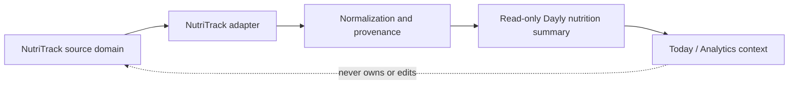

# Dayly NutriTrack Integration Architecture

**Phase:** 0D — Integration Architecture
**Status:** Approved (historical)
**Related documents:** [`INTEGRATION_ARCHITECTURE.md`](INTEGRATION_ARCHITECTURE.md), [`DATA_OWNERSHIP.md`](DATA_OWNERSHIP.md), [`DOMAIN_MODEL.md`](DOMAIN_MODEL.md), [`SYNC_ERROR_MODEL.md`](SYNC_ERROR_MODEL.md)

> This document defines a future read-oriented boundary between Dayly and NutriTrack. It does not implement an API, OAuth, data synchronization, nutrition calculations, database changes, UI, or application code.

## 1. Boundary and purpose

NutriTrack remains the source of truth for nutrition and health-related tracking. Dayly may eventually consume a small, consented set of summaries to add context to Today or Analytics.



Dayly must not become a second nutrition database, reimplement NutriTrack business logic, import a detailed food diary without a concrete product need, or turn health information into a medical or universal productivity judgment.

## 2. Conceptual integration records

### 2.1 Integration Connection

A User-authorized connection contains, conceptually:

- Dayly User owner;
- provider key for NutriTrack;
- external NutriTrack user reference;
- connection/authorization state;
- consent version and selected categories/scopes;
- last attempted and successful sync moments;
- freshness, stale, revoked, or error state;
- disconnect/revocation metadata.

Provider credentials and tokens belong in the secure integration boundary, not in ordinary Dayly domain records.

### 2.2 Nutrition summary read model

A future normalized summary may contain:

- source category/metric;
- source period, usually a local date or bounded period;
- normalized value and unit where appropriate;
- source update time if available;
- imported time;
- freshness/quality state;
- provenance and consent scope;
- unsupported/missing/partial indicator.

The read model should be sufficient for the agreed Dayly context while remaining discardable/rebuildable from NutriTrack.

### 2.3 Source data, cached summary, derived insight

| Layer | Example | Owner | Dayly behavior |
|---|---|---|---|
| **Source data** | Food entries, recipes, nutrient calculations, body/health records | NutriTrack | Do not duplicate or edit through Dayly. |
| **Cached summary** | Daily nutrition summary or approved macro context | NutriTrack source, Dayly cache | Read-only, source/freshness labeled, consented, retention-controlled. |
| **Derived insight** | “Nutrition context may be relevant today” | Dayly derived view | Must be explainable, non-medical, and never treated as source truth. |

## 3. Identity mapping

The integration must not assume that a NutriTrack account and Dayly account share an email, login provider, or database identifier.

```text
Dayly User
    │ owns
    ▼
Dayly NutriTrack Integration Connection
    │ stores provider-scoped reference
    ▼
NutriTrack external user identity
```

Recommended conceptual mapping:

- Dayly authenticates/identifies its User through the future identity boundary.
- The user explicitly connects NutriTrack.
- NutriTrack returns or confirms an external user reference through the approved authorization/connection contract.
- Dayly stores the provider-scoped reference and connection metadata.
- Matching by email alone is not sufficient for identity binding.
- If one NutriTrack identity can connect to multiple Dayly users or vice versa, the contract must define whether that is permitted and how access is isolated.

## 4. Consent and scope

Before connection, Dayly should explain:

- NutriTrack is a separate product and data owner;
- what summary categories Dayly may read;
- where the summary may appear in Dayly;
- how often it may refresh and how stale values are labeled;
- whether Dayly stores a cache;
- how disconnect and deletion affect cached data;
- that the information is not medical advice.

Consent should be:

- specific to the integration and approved categories;
- versioned so changed language/scope can be identified;
- revocable;
- recorded without storing unnecessary source payloads;
- checked before every sync/read operation.

The exact consent language, scopes, and legal basis are unresolved and require product/privacy review.

## 5. Data minimization candidates

The smallest useful set must be decided by an actual Dayly feature. The following are candidates for evaluation, not approved commitments:

| Candidate | Potential Dayly use | Initial posture |
|---|---|---|
| Daily nutrition summary | Context card or daily review | Most plausible first category if NutriTrack supports a stable summary contract. |
| Energy/calorie progress | Context for a user's own nutrition review | Optional; avoid presenting it as a productivity target or health judgment. |
| Macro progress | High-level nutrition context | Optional; require clear units, period, and source freshness. |
| Water summary | Daily context if the user explicitly values it | Optional; not needed for core Dayly planning. |
| Meal completeness | Broad summary of logged meals | Optional; define missing/partial logging carefully. |
| Weight | Trend context | Defer; sensitive and not required for initial Dayly value. |
| Detailed food diary | Full entries, recipes, ingredients, nutrients | Exclude unless a concrete approved Dayly workflow requires it. |
| Medical/diagnostic data | Diagnosis, treatment, clinical interpretation | Exclude from Dayly scope. |

A first implementation should prefer one or two read-only daily summary categories over a generic nutrition mirror. Final metrics, units, precision, freshness, and retention require NutriTrack contract review.

## 6. Synchronization model

Recommended future flow:

```text
Connection approved
      ↓
Initial bounded read
      ↓
Normalize selected summary
      ↓
Validate source period/provenance
      ↓
Store or refresh read model
      ↓
Expose source-labeled Dayly context
```

Later refresh may be:

- user-requested from Settings or the contextual card;
- scheduled at a bounded frequency if consent and provider capability support it;
- triggered by a provider webhook/push signal if available and verified;
- reconciled periodically so push is not the sole correctness mechanism.

The first connection should not import the entire NutriTrack history by default. Use a bounded recent period required by the Dayly feature.

### 6.1 Freshness

The summary must distinguish:

- source data period;
- source last-updated moment when available;
- Dayly import moment;
- freshness policy for display;
- stale/partial/error state.

A stale value may remain visible as historical context only if it is clearly labeled. Missing data is not zero.

### 6.2 Partial and invalid data

If one metric/category fails, preserve successful categories with a partial state where safe. Invalid units, unsupported metrics, or ambiguous periods must be rejected or marked unavailable rather than normalized into a plausible-looking value.

## 7. Disconnect, revocation, and deletion

### Disconnect

A user disconnect action should:

1. stop new sync operations;
2. invalidate/revoke stored credentials through the secure boundary where supported;
3. mark the connection disconnected;
4. stop showing the cached summary as current;
5. apply the later retention policy to cached summaries;
6. keep Dayly Tasks, Projects, Calendar Events, Schedule Blocks, Habits, Focus, and Analytics usable.

### Provider revocation

If NutriTrack revokes access or a token becomes invalid:

- mark the connection auth-required/revoked;
- do not retry indefinitely;
- keep last-known summary only as stale context if policy allows;
- show a recovery path;
- do not delete source-independent Dayly data.

### Deletion

The treatment of cached summaries, derived analytics that used them, audit metadata, and a NutriTrack-side deletion request is unresolved. Dayly must not claim source deletion if it can only delete its cache.

## 8. Security and privacy boundary

- Use least-privilege, read-oriented authorization.
- Keep access/refresh credentials server-side and encrypted through the future secret boundary.
- Never place tokens in browser state, URLs, logs, analytics, or ordinary read models.
- Enforce User ownership and integration consent before reading a summary.
- Redact nutrition payloads from operational logs.
- Treat nutrition/health context as sensitive; limit staff/operator access.
- Use TLS for data in transit and managed encryption at rest when implemented.
- Record safe connection/sync audit facts without retaining full source payloads unnecessarily.

## 9. Dayly UX placement

The approved UX architecture allows a clearly labeled optional summary in Today or a future contextual analytics area:

```text
Today
 └── Optional NutriTrack nutrition context
      ├── source label
      ├── source period/freshness
      ├── summary only
      └── manage connection
```

The card should not be part of required onboarding, should not crowd primary daily actions, and should disappear or become an explicit stale/disconnected state according to the retention/display decision.

## 10. Testing strategy for later implementation

- identity binding cannot cross Dayly Users;
- consent scopes are enforced for every read;
- initial sync imports only approved bounded summaries;
- duplicate sync is idempotent;
- stale/partial/invalid source data is labeled correctly;
- token expiration/revocation requires user action without core Dayly failure;
- disconnect prevents later reads and follows cache policy;
- logs contain no credentials or unnecessary detailed food data;
- summary units, periods, time zones, and provenance survive normalization;
- source calculations are not reimplemented in Dayly.

## 11. Open NutriTrack decisions

- NutriTrack authorization and identity contract.
- Approved metric categories, units, and periods.
- Whether calorie/macro/water/meal-completeness summaries are useful and safe.
- Whether weight or other sensitive measures are excluded permanently or require a separate feature.
- Freshness thresholds and scheduled refresh frequency.
- Webhook/push availability and verification.
- Cached summary retention after disconnect/revocation.
- Account deletion and source-side deletion coordination.
- Exact Dashboard/Analytics placement and user controls.
- Privacy/legal review and consent copy.

## 12. Phase boundary

No NutriTrack connection, API contract, credential, OAuth flow, synchronization job, database migration, UI, or application code was created.
