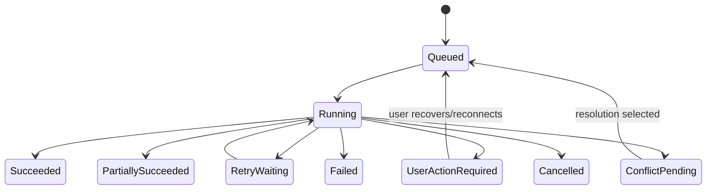

# Dayly Synchronization Error Model

**Phase:** 0D — Integration Architecture
**Status:** In progress
**Related documents:** [`INTEGRATION_ARCHITECTURE.md`](INTEGRATION_ARCHITECTURE.md), [`CALENDAR_SYNC_MODEL.md`](CALENDAR_SYNC_MODEL.md), [`NUTRITRACK_INTEGRATION.md`](NUTRITRACK_INTEGRATION.md)

> This document defines conceptual sync states, error classes, retry behavior, user-facing degradation, and observability. It does not implement a queue, worker, provider adapter, logger, API, database migration, or UI.

## 1. Error-model goals

Integration failures must be:

- classified consistently across providers;
- safe to retry only when the operation is idempotent;
- visible to the user when action or trust is affected;
- observable without logging secrets or unnecessary private payloads;
- isolated so a provider failure does not corrupt Dayly-owned data;
- recoverable through refresh, reauthorization, scope change, conflict resolution, or support diagnostics.

A provider-specific error code may be retained as sanitized metadata, but the application responds to a normalized category and retryability decision.

## 2. Sync operation states



### 2.1 State meanings

- **Queued:** Accepted for processing but not started.
- **Running:** Adapter/sync engine is actively processing a bounded operation.
- **Succeeded:** All requested work completed and checkpoint/state is committed.
- **Partially Succeeded:** Some bounded work committed; remaining records/errors are reported.
- **Retry Waiting:** Transient failure is waiting for backoff/retry.
- **User Action Required:** Authorization, permission, invalid consent, or an unresolved provider action blocks progress.
- **Conflict Pending:** A source change cannot be applied safely without a policy/user decision.
- **Failed:** Operation stopped without a safe automatic retry; connection may be degraded.
- **Cancelled:** Deliberately stopped or superseded operation; no false success.

Connection health is separate from the operation state. A connection can remain connected while a single operation fails, or require reauthorization even when the last operation succeeded.

## 3. Normalized error categories

| Category | Examples | Automatic retry | User action | Degradation |
|---|---|---:|---:|---|
| **Authentication** | Missing/invalid session or provider authorization context | Usually no | Yes | Keep external data last-known/stale; core Dayly works. |
| **Authorization** | Scope insufficient, calendar/category not permitted | No until scope changes | Yes | Hide unavailable source; preserve Dayly data. |
| **Token expired** | Access token expired and refresh is unavailable | One bounded refresh attempt | Usually yes | Mark Auth Required if refresh fails. |
| **Revoked permission** | Provider/user revoked access | No repeated retry | Yes, reconnect | Stop reads/writes; do not claim current sync. |
| **Rate limit** | Provider asks client to slow down | Yes with provider hint/backoff | Not normally | Show last successful sync and retry status. |
| **Network** | Timeout, DNS, transient connection failure | Yes with bounded backoff | Not normally | Stale external context; core Dayly works. |
| **Provider outage** | Provider unavailable or service error | Yes with bounded/circuit-broken retry | Not normally | Keep last-known source status and inform user if stale. |
| **Invalid data** | Unsupported time, recurrence, unit, malformed identity | No for same payload | Maybe; support/adapter fix | Skip/reject record, mark partial/error, preserve other records. |
| **Conflict** | Both sides changed, ambiguous delete/recurrence/time zone | No blind retry | Yes or explicit policy | Keep conflict visible; do not overwrite. |
| **Cursor invalid** | Incremental checkpoint expired/invalid | Retry with full reconciliation | Not normally | Mark syncing/reconciliation; avoid duplicate data. |
| **Webhook verification** | Invalid signature, unknown source, replay | No payload processing | Operator/provider investigation | Ignore safely; periodic sync remains correctness path. |
| **Provider contract** | Unsupported capability or changed response shape | No blind retry | Implementation/operator action | Mark degraded; do not corrupt normalized records. |
| **Unknown** | Unclassified failure | Conservative bounded retry only | Operator/support action | Mark degraded/error with correlation ID. |

## 4. Retry policy

### 4.1 Safe retry requirements

Before retrying, determine:

- operation idempotency key;
- whether any page/record was already committed;
- whether the provider operation was read-only or had an external side effect;
- whether the provider supplied a retry-after value;
- whether the error is transient or user-action-required;
- whether a cursor/checkpoint can safely resume.

Never retry a write blindly when the response may have been lost and no mapping/idempotency key can identify the prior side effect.

### 4.2 Backoff

Use bounded exponential backoff with jitter for transient network, provider outage, and rate-limit failures. Provider retry-after instructions take precedence when safe. The exact base, multiplier, maximum, and attempt count are implementation decisions.

A retry budget must terminate in a visible degraded/error state rather than creating an infinite background loop.

### 4.3 Circuit breaking and coalescing

If a provider or connection repeatedly fails:

- pause automatic work for that connection/provider for a bounded cool-down;
- coalesce duplicate refresh requests;
- avoid retry storms across many Users;
- permit an explicit user/operator retry when appropriate;
- keep Dayly core operations independent.

## 5. Failure handling by pipeline stage

| Stage | Failure treatment |
|---|---|
| Authorization initiation | Do not create a healthy connection; report cancellation/denial safely. |
| Token exchange/refresh | Redact provider response; mark auth-required/revoked; bounded recovery. |
| Resource discovery | Keep previously known calendars/categories with stale status; do not erase them on a transient failure. |
| Read page/change fetch | Retry if transient; commit cursor only after page processing succeeds. |
| Normalization | Reject invalid record safely, store sanitized category/count, continue independent records when possible. |
| Ownership validation | Reject cross-owner/malformed relation; alert operationally; never attach to another User. |
| Idempotent upsert | Retry/reconcile by stable identity; never create a duplicate fallback record. |
| Delete/tombstone processing | Require authoritative deletion signal; transient absence is not deletion. |
| Conflict detection | Create pending conflict/action state; do not silently choose a version. |
| Export/write | Require explicit capability/permission and idempotency; record provider failure without rolling back source-owned Dayly data. |
| Checkpoint commit | Retry/recover conservatively; replay from last known checkpoint safely. |
| Webhook receipt | Verify before queueing; reject invalid/replayed signals; periodic sync remains available. |
| Observability emission | Do not fail the source sync merely because a non-critical metric/log path is unavailable; retain enough health state for recovery. |

## 6. User-facing degradation

Dayly should communicate actionably:

- **Healthy:** Last successful sync and selected source are current within policy.
- **Syncing:** An operation is in progress; do not promise completion yet.
- **Stale:** Last-known external data is shown with its time/freshness label.
- **Needs reconnection:** Provider permission/token is no longer valid.
- **Partial:** Some calendars/categories/records updated; affected scope is identified.
- **Conflict needs review:** A source change cannot be applied safely.
- **Unavailable:** No usable external data is available.

The user should still be able to create/complete Dayly Tasks, Projects, Dayly Events, Habits, and Focus Sessions unless the failed operation specifically concerns that source-owned action.

## 7. Error record and observability fields

A conceptual sanitized error/operation record may include:

- operation/correlation ID;
- User and connection scope;
- provider/capability;
- operation kind and bounded range;
- normalized error category;
- sanitized provider code/status;
- retryable/user-action/conflict flags;
- attempt number and retry budget state;
- first/last occurrence moments;
- next retry moment;
- last successful sync moment;
- record counts and partial scope;
- safe user-facing recovery key/message;
- redacted diagnostic context.

Never include access tokens, refresh tokens, client secrets, authorization codes, full nutrition payloads, or full private event bodies by default.

## 8. Connection health transitions

```text
Healthy
  ├── transient failure → Degraded → retry/recover → Healthy
  ├── repeated failure → Error / circuit pause
  ├── token issue → Auth Required
  ├── permission revocation → Revoked
  └── user disconnect → Disconnected
```

Health transitions must not delete source data or make a stale value look current. A successful manual retry returns to Healthy only after the relevant operation commits successfully.

## 9. Security behavior

- Error responses exposed to users are sanitized and do not reveal provider secrets or internal stack traces.
- Logs use structured categories and redaction.
- Correlation IDs help support diagnose failures without sharing private payloads.
- Webhook signatures/verification are checked before any state change.
- RLS and User ownership are enforced for stored connection/error state.
- Operators have least-privilege access to diagnostics.
- Rate-limit and outage handling avoids denial-of-service retry loops.

## 10. Testing strategy

### Unit

- classify provider adapter errors;
- calculate retryability/backoff decisions;
- redact sensitive values;
- preserve idempotency keys;
- transition connection/operation states.

### Contract

- map representative provider errors into normalized categories;
- verify normalized event/time/recurrence/data-summary validation;
- test provider capability declarations and unsupported paths.

### Integration

- token expiration/refresh/revocation;
- full and incremental sync;
- page retry and checkpoint commit;
- provider outage/rate limit;
- source deletion/tombstones;
- conflict detection/resolution;
- disconnect and stale-data behavior.

### Security

- cross-User connection isolation;
- invalid webhook/signature rejection;
- no secret/payload leakage in logs;
- unauthorized write/export rejection;
- replay/idempotency protection.

No tests are written in this phase.

## 11. Open questions

- Maximum retry budget and provider-specific backoff rules.
- Queue/worker and circuit-breaker implementation.
- Exact user/operator error message taxonomy.
- Conflict-resolution persistence and UI.
- Whether partial records are retried individually or by page.
- Cursor invalidation/full-sync thresholds.
- Webhook replay window and deduplication storage.
- Operational retention for error/operation history.
- Offline Dayly mutation behavior while external operations are pending.
- Provider-specific error mappings after current documentation/sandbox verification.

## 12. Phase boundary

No sync queue, retry worker, provider integration, webhook handler, error logger, API route, migration, UI, or application code was created.
