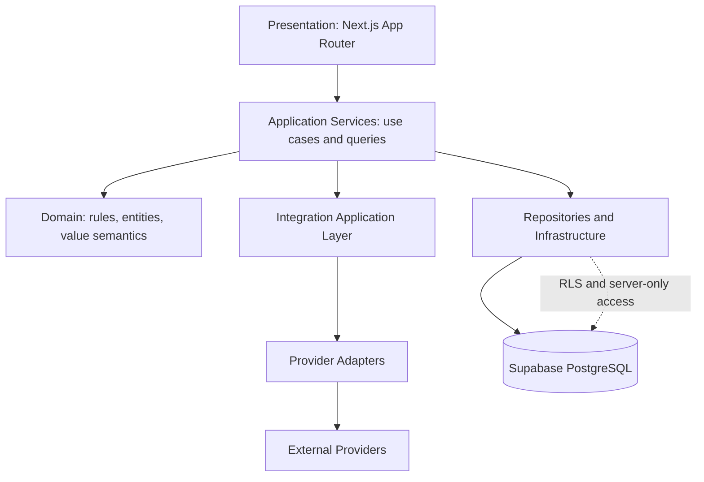

# Dayly Technical Specification

**Phase:** 0E — Technical Specification & Engineering Contract
**Status:** In progress
**Document role:** Final pre-implementation technical contract

> This document establishes implementation constraints for future phases. It does not initialize Next.js, create database tables or migrations, implement authentication/integrations, install dependencies, or write production code.

## 1. Technical contract

Future implementation must preserve the approved product, UX, domain, data, and integration boundaries. A technical convenience must not:

- merge Tasks, Projects, Calendar Events, Schedule Blocks, Habits, Focus Sessions, or external records;
- make a derived view a second source of truth;
- place provider logic inside Dayly core domains;
- expose server secrets or bypass RLS;
- require an external integration for the MVP core;
- introduce a dependency, framework, schema change, or API behavior without documentation and review.

The detailed contracts are split into the documents in this directory. This document is the index and implementation-level summary.

## 2. Approved technology stack

| Concern | Approved choice | Contract |
|---|---|---|
| Full-stack framework | Next.js 15 | Use the App Router. Server-first rendering is the default. |
| Language | TypeScript | Strict mode is required. Domain and application types are explicit. |
| Styling | Tailwind CSS v4 | Use for styling and responsive composition; final design tokens remain a later Design System concern. |
| Backend/platform | Supabase | Use Supabase Auth, PostgreSQL, and Realtime only where justified. |
| Database | PostgreSQL through Supabase | Repositories and RLS own access; UI components do not issue arbitrary queries. |
| Runtime validation | Zod or an equivalent strongly typed schema approach | The selected library must infer/use TypeScript types at trust boundaries; default recommendation is Zod. |
| Unit tests | Vitest | Pure domain, validation, utility, and application behavior. |
| Component tests | React Testing Library | User-observable interaction behavior, not implementation details. |
| End-to-end tests | Playwright | Critical journeys and cross-boundary behavior. |

Changing a listed choice requires a documented architectural reason and an ADR before implementation. This phase does not install any of these dependencies.

## 3. High-level architecture



The conceptual dependency direction is:

```text
Presentation
     ↓
Application Services
     ↓
Domain
     ↓
Repositories / Infrastructure
     ↓
External Services
```

The arrows describe allowed orchestration, not a requirement that every request traverse every layer.

### 3.1 Presentation layer

Owns route composition, page/layout composition, accessible interaction, loading/error/empty states, and user-facing DTO rendering.

- Next.js Server Components are the default for read-oriented pages.
- Client Components are used only where browser interaction, local state, timers, or event handlers require them.
- Presentation calls application query/mutation boundaries, not Supabase or provider SDKs.
- Presentation does not contain domain rules such as overdue calculation, recurrence interpretation, ownership checks, or sync conflict resolution.

### 3.2 Application services

Own use-case orchestration and application policies:

- resolve the authenticated actor/User;
- validate input at the trust boundary;
- call domain rules;
- coordinate repositories and transactions;
- enforce authorization in addition to RLS;
- map domain records to stable DTOs;
- invoke integrations through capability contracts;
- return typed success or normalized errors;
- invalidate/revalidate affected read views.

Application services are the preferred public interface between Presentation and the rest of the system.

### 3.3 Domain layer

Owns pure Dayly business meaning:

- task lifecycle and scheduling semantics;
- project/task relationships;
- habit occurrence and consistency rules;
- focus duration semantics;
- notification intent rules;
- value validation that is independent of a provider or framework.

The Domain layer must not import Next.js, React, Supabase clients, browser APIs, Google APIs, Microsoft APIs, Apple APIs, NutriTrack APIs, or environment modules.

### 3.4 Repositories and infrastructure

Own persistence implementation and infrastructure concerns:

- repository implementations for PostgreSQL/Supabase;
- transaction/unit-of-work behavior;
- RLS-aware server client creation;
- mapping database records to domain records/DTOs;
- pagination/filter/sort queries;
- cache adapters and observability integrations.

Repository interfaces should be stable at the application/domain boundary. Supabase response shapes must not leak into Presentation or core Domain logic.

### 3.5 External services

External services include Supabase platform services and future provider adapters. They are accessed through server-only integration/infrastructure boundaries. External provider behavior is normalized before it reaches Dayly domain code.

## 4. Module boundaries

The module contract is summarized here and detailed in [`PROJECT_STRUCTURE.md`](PROJECT_STRUCTURE.md). Each module exposes use cases/query contracts and hides persistence/provider details.

| Module | Owns | May depend on | Must not depend on |
|---|---|---|---|
| **users** | User context, Profile, preferences, planning settings | Shared types, authorization boundary | Task internals, provider APIs, UI components |
| **tasks** | Task lifecycle, task content, tags, parent relation | Shared IDs/value types, application ports | Calendar provider logic, Habit/Focus completion shortcuts |
| **projects** | Project outcome/lifecycle and task grouping | Shared IDs, task query ports | Database client, provider adapters, Habit rules |
| **calendar** | Dayly Events, Schedule Blocks, availability interpretation | Task IDs, shared time values, integration read models through application layer | Google/Apple/Outlook APIs, Task completion logic |
| **habits** | Habit definitions and occurrence decisions | Time/recurrence values, notifications through application layer | Task status, nutrition data, provider code |
| **focus** | Focus Session state and actual duration | Task/Project IDs, clock abstraction | Automatic task completion, provider APIs |
| **notifications** | Reminder intent and in-product notification state | Source IDs, preferences, time | Source record mutation, delivery provider internals |
| **analytics** | Read-only metric definitions and projections | Read/query ports from source domains | Source record mutation, universal productivity score |
| **search** | Query parsing, result grouping, derived index contract | Read/query ports, source labels | Independent editable copies, provider-specific queries |
| **integrations** | Connection orchestration, normalization, sync/error contracts | External adapters, application services, ownership | Core domain provider branches, browser secrets |
| **shared** | Cross-cutting primitives and safe utilities | No feature modules | Feature business rules and cyclic imports |

Circular dependencies are prohibited. Cross-module workflows are orchestrated by application services or neutral query/projection ports, not by importing another module's private internals.

### 4.1 Public contracts and test boundaries

| Module | Public interface | Internal logic | Test boundary |
|---|---|---|---|
| **users** | Actor resolution, profile/preferences commands and queries | Profile, preference, availability, and ownership mapping | Pure preference/authorization units plus repository/application integration tests. |
| **tasks** | Create/update/complete/reopen/archive/query task commands and task projections | Lifecycle, parent-depth, deadline, priority, tag, and task-condition rules | Pure domain transition tests; application/repository ownership tests; component tests for task interactions. |
| **projects** | Project commands, task-group queries, project context | Project lifecycle, membership/order, and progress input projection | Domain lifecycle tests; application/repository relationship tests; Project UI behavior tests. |
| **calendar** | Dayly Event and Schedule Block commands/queries, availability reads | Event/time semantics, schedule conflict inputs, all-day/recurrence values | Time/range unit tests; repository/query tests; Calendar interaction tests. |
| **habits** | Habit and occurrence commands/queries | Recurrence, occurrence, missed/completed, streak/consistency rules | Deterministic clock/time-zone unit tests; application persistence tests; Habit UI tests. |
| **focus** | Start/pause/resume/finish/review session commands/queries | Duration, interruption, orphan context, and session lifecycle | Clock-controlled unit tests; transaction/concurrency tests; Focus interaction tests. |
| **notifications** | Reminder and in-product notification commands/queries | Trigger, read/handled, snooze/expiry rules | Trigger/state unit tests; repository tests; accessibility/component tests. |
| **analytics** | Read-only metric query interface and source drill-down references | Metric definitions, periods, missing-data treatment, projection rules | Fixture-based metric tests; query/performance tests; analytics comprehension tests. |
| **search** | Validated search query and grouped result interface | Query normalization, ranking/grouping, source mapping | Query/parser unit tests; repository/index tests; no-results/accessibility component tests. |
| **integrations** | Connection, sync, normalized external-data, and error contracts | Provider capability orchestration, provenance, idempotency, retry/conflict mapping | Adapter contract tests; sync/error/replay integration tests; security/ownership tests. |

A module's public interface is the only interface other modules may consume. Test boundaries should prefer pure domain tests first, then application/repository tests, then user-observable tests.

## 5. Data access contract

- UI components never create ad hoc database queries.
- Server-only repositories own PostgreSQL/Supabase access.
- RLS is an additional enforcement boundary, not a replacement for application authorization.
- Server Components may call server-side application query services directly; they must not make a browser-style request to the same server just to read data.
- Server Actions are appropriate for authenticated UI mutations when the action is local to the application.
- Route Handlers are reserved for HTTP contracts, provider callbacks/webhooks, exports, or clients that cannot call a Server Action.
- Background work such as integration sync and scheduled notifications belongs in a future worker/job boundary, not a long-running request.
- Transactions begin at an application use-case boundary when multiple source records must change atomically.
- Concurrency uses explicit optimistic version/updated-at checks or a documented transaction/isolation strategy.
- Mutations that can be retried use idempotency keys where the use case has external or repeated side effects.
- Lists use validated filters, stable sort order, bounded limits, and cursor pagination where data can grow.

### 5.1 Supabase Realtime

Supabase Realtime is optional and justified only for user-visible changes that benefit from timely updates, such as an active Focus Session state or a future integration operation status. It is not the source of truth, a replacement for queries/mutations, or a reason to subscribe every list/card. Every subscription must:

- be User/RLS-scoped;
- have a bounded lifecycle tied to the screen/feature;
- handle disconnect/reconnect and missed events through refetch/reconciliation;
- avoid exposing private payloads to unauthorized clients;
- provide a non-Realtime fallback.

The MVP may use ordinary server revalidation/polling for most views. Realtime should be added only after a measured UX need and security review.

## 6. API and type contracts

HTTP and action conventions are defined in [`API_CONVENTIONS.md`](API_CONVENTIONS.md). Error taxonomy is defined in [`ERROR_HANDLING.md`](ERROR_HANDLING.md). TypeScript rules include:

- strict compiler mode;
- no `any` except a documented, localized boundary exception;
- `unknown` at untrusted boundaries until validated;
- branded/opaque IDs where mixing identifiers would be dangerous;
- discriminated unions for lifecycle/operation states;
- DTOs at API/application boundaries when domain entities should not leak;
- one canonical domain type per concept, with explicit adapters rather than incompatible copies;
- runtime schemas paired with inferred/static types;
- generated Supabase types isolated in infrastructure and mapped to domain/application types.

## 7. State, caching, and offline defaults

The default state strategy is:

- **Server state:** Server Components and application query services.
- **URL state:** Search query, filters, selected date/range, sort, page/cursor, and shareable view state.
- **Local component state:** Form drafts, open dialogs, temporary selection, timer display, and transient feedback.
- **Persistent preferences:** User-owned settings through application services.
- **Client cache:** Only where interactive refresh/optimistic behavior justifies it; no global state library by default.
- **Offline:** Cached/read-only known content and drafts may be shown; full offline-first mutation queues are not promised for MVP.

Caches must be User-scoped, freshness-aware, invalidated after mutations, and unable to expose one User's data to another. Integration freshness is separate from Dayly source freshness.

### 7.1 Offline behavior

MVP does not promise full offline-first operation:

- Previously loaded, User-authorized content may remain readable with an explicit stale/offline indicator.
- New server data is not represented as current until a request succeeds.
- Local form drafts may be preserved in memory or a deliberately scoped browser mechanism, but drafts are not claimed to be saved records.
- Mutations default to retry/manual recovery rather than an invisible offline queue. A queued mutation is allowed only after its idempotency, ordering, conflict, privacy, and storage behavior is specified.
- Safe local optimistic feedback must be reversible and must clearly transition to failed/pending if persistence cannot be confirmed.
- External provider sync is not attempted from an offline browser; a future server queue/outbox may reconcile it with provider-specific rules.
- Reconnection does not silently overwrite newer server data; stale-write/concurrency handling applies.

### 7.2 Responsive implementation contract

Implement mobile-first responsive composition using the UX bands:

- **Mobile:** approximately 320–767px; Today/Tasks/Calendar/Focus bottom navigation, More drawer, bottom sheets, focused full-screen forms, compact vertical Calendar.
- **Tablet:** approximately 768–1023px; hybrid rail/sidebar, adaptive list/detail, focused Calendar views when space is constrained.
- **Desktop:** 1024px and above; persistent sidebar, local navigation, list/detail where readable, richer Calendar timeline.

The implementation must preserve the UX hierarchy rather than simply scale desktop. Drag/hover/swipe interactions require visible alternatives, and touch targets/focus behavior must satisfy [`ACCESSIBILITY.md`](ACCESSIBILITY.md).

## 8. Time and date contract

- Persisted instants use unambiguous UTC/instant semantics.
- Recurring/local intent retains an IANA time-zone identifier.
- Date-only values remain date-only.
- All-day events use local date semantics, not UTC-midnight masquerading as a time.
- DST transitions and timezone changes require explicit tests.
- User timezone changes affect future interpretation, not historical timestamps.
- No persisted naive local timestamp may represent an instant.

## 9. Security and operational contracts

Security is defined in [`SECURITY_MODEL.md`](SECURITY_MODEL.md). Environment boundaries are defined in [`ENVIRONMENT.md`](ENVIRONMENT.md). Operational logging and metrics are defined in [`OBSERVABILITY.md`](OBSERVABILITY.md).

The minimum contract is:

- authentication proves identity;
- authorization determines what the actor may access or mutate;
- server-only secrets never enter client bundles;
- every User-owned read/write is protected by application authorization and RLS;
- provider data is provenance-labeled and least-privilege;
- errors expose safe messages and correlation IDs, not stack traces or secrets;
- performance, accessibility, and responsive behavior are acceptance criteria, not post-launch cleanup.

## 10. Final architecture diagram

```text
                                  Dayly
                                    │
                    ┌───────────────┴────────────────┐
                    │                                │
             Presentation                       Application
        Next.js App Router                 Services / Use Cases
                    │                                │
                    └───────────────┬────────────────┘
                                    │
                                 Domain
                                    │
                    ┌───────────────┴────────────────┐
                    │                                │
             Persistence                       Integrations
        Repositories / Supabase        Provider-neutral adapters
                    │                                │
             PostgreSQL / RLS              ┌────────┼────────┐
                                            │        │        │
                                         Google   Apple   Outlook
                                                           │
                                                     NutriTrack
```

## 11. Implementation sequence

Future implementation should proceed in small, reviewable increments:

1. establish the approved framework/tooling baseline;
2. establish domain/application/repository boundaries;
3. implement and test one vertical Dayly-owned workflow;
4. add persistence/RLS through reviewed migrations;
5. add UX states and accessibility verification;
6. add integrations only after provider contracts and security review;
7. add observability/performance validation before broadening scope.

This sequence does not authorize PHASE 1. It is the contract that PHASE 1 and later implementation must follow.
